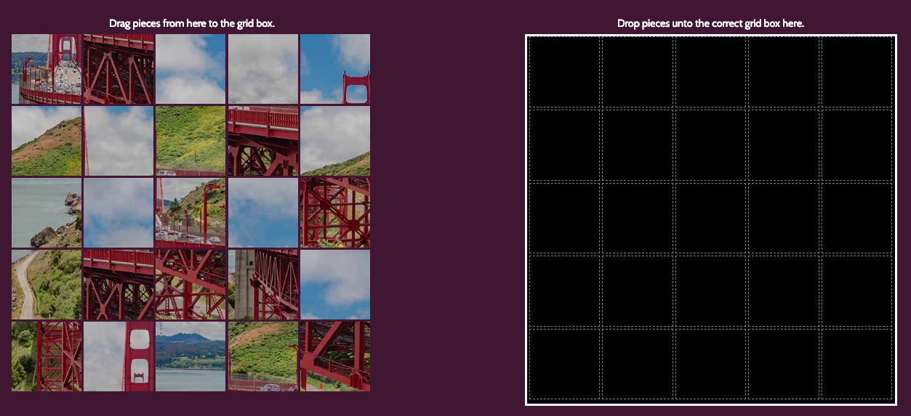

# Life's a Drag
## My First Game
Welcome to the first software game I ever developed. I wrote this in HTML, CSS Flex and Javascript. I hope you enjoy it. This project was assigned to me as a student of General Assembly in NYC, studying web Development in the Web Development Immersive course.

## Description
This is a simple image puzzle game. On one side, you will see a collection of shuffled image tiles. The objective is to complete the original image. Move image tiles one-at-a-time to a correct grid in the drop zone. The completed image will emerge once all the images pieces are placed in their correct positions.

## How to Play
Press refresh to reshuffle the pieces. You can move an image tile by using a drag-and-drop method. Select an image piece by clicking on it and holding the click down. Move the piece by holding down the click, while simultaneously moving your mouse to a proper position in the drop-zone. Once you are ready to drop the piece, just release the click button. An alert will display informing you if the piece is in the correct grid box or not. Timers and points have been excluded to allow for the simple enjoyment of completing the puzzle. At any time during the puzzle, you can click refresh to restart with a fresh shuffle.

## Levels of Play:
#### Round One
An image puzzle with 9 evenly sized tiles awaits your keen attention to visual detail. Complete this round by placing all image pieces unto the correct grid box in the drop zone.

#### Round Two
An image puzzle with 16 pieces awaits your keen attention to visual detail and clues. Complete this round by placing all image pieces unto the correct grid box in the drop zone.

#### Round Three
An image puzzle with 25 pieces awaits your keen attention to visual detail, clues and patience. Complete this round by placing all image pieces unto the correct grid box.

# Screenshots:
## Level One

## Level Two

## Level Three

## Link to the Game:
[Life's a Drag Puzzle Game](https://solitonyc.github.io/puzzle-game/)

## Additional Information
Hopefully, I can return to this project in the future to add more features. There is a strange bug, where if I continue to zoom out to about 25%, eventually the drop zone breaks. It's a behavior I don't think many users ever do with their browser. 

## Image Copyright
All photography used in this game are original works of art produced by Solito Reyes II. The images and sliced image pieces are the property and copyright of Solito Reyes II, 2019. Do not use without written permission. Check out [Solito's Flickr Account:](https://www.flickr.com/people/solitoreyes/)

## Credits:
#### W3 Schools
I learned a lot from playing with [W3 Schools](https://www.w3schools.com/) lessons on their site. The site helped me with understanding drag & drop, event listeners and refining my understanding of structuring functions. 

#### Fisher Yates Algorithm
I tried out a bunch of different shuffling algorithms for mixing up my image pieces. In my research I read a lot about the deficiencies, and the "not so random" phenomenon, ailing other algorithms that came before Fisher Yates. I also like the eloquence of the code, which makes it easy to implement. Here's a great article that explains the evolution: [Fisher Yates Shuffle by Mike Bostock](https://bost.ocks.org/mike/shuffle/)

## Contact Me
Please feel free to email me with any bugs you may find or other suggestions to improve my game: solitonyc@gmail.com
